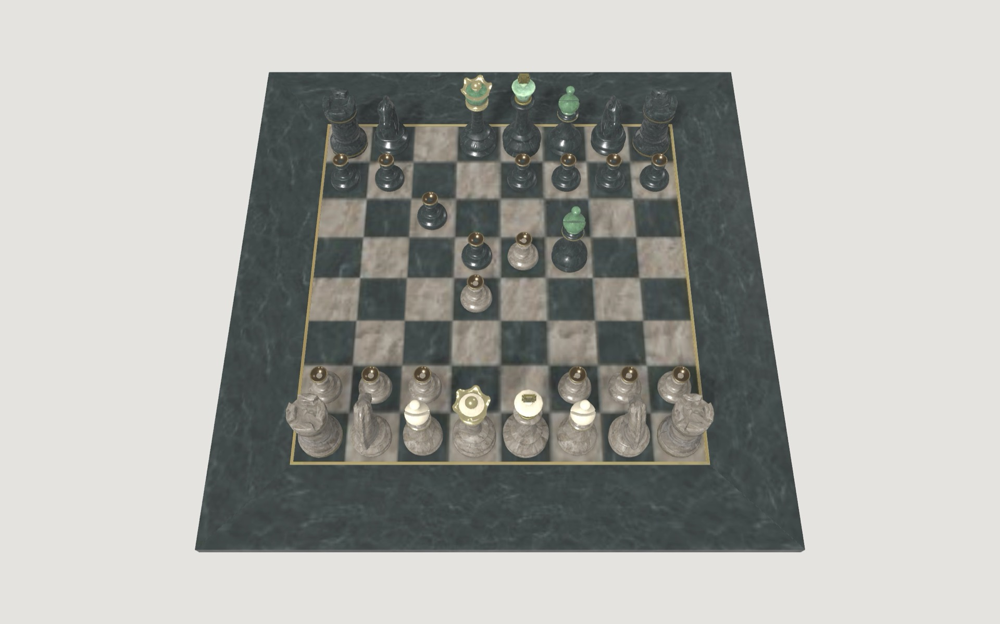

# puddle-chess



A playable 3D chess set as a wallpaper. It is a plugin for
[Puddle](https://github.com/gapul/Puddle): one `.bundle` that Puddle loads and shows, and that
Puddle otherwise knows nothing about.

Click a piece and its legal squares light up; click one and the piece slides there. Stockfish
plays the other side, or both. Puddle sits at desktop level and gets no clicks, so the board is
playable while Browsing Mode is on. Outside a move the render loop is off entirely: a still
board costs nothing.

## Install

```console
$ open -g 'puddle:install?url=https://github.com/gapul/puddle-chess/releases/latest/download/puddle-chess.zip'
```

That needs this repository in Puddle's `~/.config/puddle/install.toml`, because a plugin is
native code and Puddle takes native code only from a source that was trusted in advance:

```toml
allow = [
    "https://github.com/gapul/puddle-chess/releases/",
]
```

Otherwise: **Add Wallpaper → Plugin…** and pick a bundle from disk.

Puddle needs `com.apple.security.cs.disable-library-validation` to load a bundle it did not
sign — it has it.

## Build

```console
$ xcodegen generate
$ xcodebuild -project PuddleChess.xcodeproj -scheme PuddleChess -configuration Release -derivedDataPath build build
$ ./tools/release.sh 1.0.0
```

`release.sh` signs the bundle, zips it, and publishes it with the catalog file, which is what the
install line above downloads.

The picture in the catalog is a photograph of the thing running:

```console
$ swiftc -O -o /tmp/capture-preview tools/capture-preview/main.swift
$ /tmp/capture-preview docs/preview.jpg
```

It captures Puddle's wallpaper window through ScreenCaptureKit and crops to the board. A
window-id capture (`screencapture -l`) is no use — it does not see the layers SceneKit draws
into and comes back white — and a screenshot of the whole display has everything stacked on top
of the wallpaper in it.

## Options

Puddle passes the wallpaper's option string through untouched. It is space-separated
`key=value` pairs, and an empty string is a valid configuration.

| Key | Values | Meaning |
|---|---|---|
| `mode` | `play` (default), `watch` | `play`: you are white, the engine answers as black. `watch`: the engine plays both sides and starts a new game a few seconds after each one ends. |
| `engine` | a path | Where Stockfish is, when it is somewhere the search would not look. |

The bundle's `Info.plist` also declares these two under `PuddleOptions`, so Puddle's editor shows
`mode` as a menu and `engine` as a field of its own instead of one box holding the whole string.
The string is still the interface; the declaration only says what goes in it.

```
mode=watch
mode=play engine=/opt/homebrew/bin/stockfish
```

## The interface to Puddle

`Source/PuddleWallpaperPlugin.swift` is a verbatim copy of the protocol Puddle declares. Nothing
is linked between the two: both sides declare the same `@objc` protocol and the Objective-C
runtime matches them by name. The explicit `@objc(PuddleWallpaperPlugin)` is what makes that
work — without it Swift mangles the runtime name with the declaring module and the two stop
being the same protocol.

`ChessScene.swift` builds the board, pieces, camera, and lighting and has no Puddle types in it
at all, so the look can be iterated on by compiling it into a small offscreen harness that
renders a PNG — much faster than launching a wallpaper to look at it.

## The opponent

`ChessEngine` talks UCI to **Stockfish** in a process of its own. That is deliberate: Stockfish
is GPLv3, and running it as a separate program keeps that boundary where it belongs. It also
means the binary is not bundled — it is found on the machine, or the board simply has no
opponent and `play` becomes a set you move both sides on by hand.

Looked for at the usual install locations (`/opt/homebrew/bin`, `/run/current-system/sw/bin`,
the nix profiles). A GUI app inherits a bare `PATH` from launchd, so searching `PATH` alone is
not enough; `engine=` in the options overrides the search.

One thread, a 16 MB table, a third of a second per move. A wallpaper's budget, not a
tournament's, and Stockfish is already far past anyone watching a desktop.

## The model

`Resources/chess-set.usdz` holds the board as `Board` and one node per piece kind and colour,
named `Pawn_White`, `Rook_Black`, and so on. It arrives normalised to the board: **one square is
one unit**, every piece stands with its base at y = 0, and the board's top face is the y = 0
plane. The scene therefore never scales anything.

### Credit

Derived from [A Beautiful Game](https://github.com/KhronosGroup/glTF-Sample-Assets/tree/main/Models/ABeautifulGame),
licensed **[CC BY 4.0](https://creativecommons.org/licenses/by/4.0/)**:

- © 2020 ASWF — MaterialX Project, for the original model
- © 2022 Ed Mackey, for the conversion to glTF

### Regenerating

```console
$ curl -LO https://raw.githubusercontent.com/KhronosGroup/glTF-Sample-Assets/main/Models/ABeautifulGame/glTF-Binary/ABeautifulGame.glb
$ blender -b --python tools/convert.py
```

The source is the whole board with all 32 pieces placed, 2K textures, and film-grade meshes —
43 MB and half a million vertices. `tools/convert.py` keeps one mesh per piece kind and colour,
parks each at the origin, decimates the pieces, and re-encodes the textures, ending at about
12 MB.

Three things in there are load-bearing and easy to undo by accident:

- **Every transform is baked into the mesh data.** Both the glTF importer and the USD exporter
  like to express orientation as a parent transform, and a parent transform is exactly what is
  lost when a consumer looks a mesh up by name — which is what `ChessScene` does. Symptom:
  pieces lying down, standing on their heads, or facing their own side.
- **The board is not decimated.** Its inlay is cut into the mesh, so collapsing it punches holes
  clean through the frame. What shows through is the backdrop, which looks like the board
  changing colour between light and dark mode — and the ragged remains look enough like an
  intentional inlay to pass for one for a while.
- **Bounds are measured from vertices, never `bound_box`.** The cached bounds go stale the
  moment mesh data is transformed, and every offset computed from them is then silently wrong.
  Same reason `bpy.ops.object.transform_apply` is avoided: it is a no-op in background mode.

## Checking the rules

`tools/rules-check/main.swift` asserts the part most likely to be silently wrong: the mapping between
ChessKit's squares and the scene's file/rank pair, and that `ChessScene.square(at:)` inverts
`ChessScene.position(file:rank:)` for all 64 squares. It also plays scholar's mate and a castle,
since castling is what proves the board is right to rebuild itself from the position rather than
move one node, and it covers UCI parsing — `hexDigitValue` has no answer for `g` and `h`, which
would quietly drop every engine move on that side of the board.

```console
$ D=build/Build/Products/Release
$ swiftc -o /tmp/rules-check tools/rules-check/main.swift Source/ChessGame.swift Source/ChessScene.swift -I $D -L $D $D/ChessKit.o
$ /tmp/rules-check
```

## License

MIT for the code. The model is CC BY 4.0 — see the credit above.
